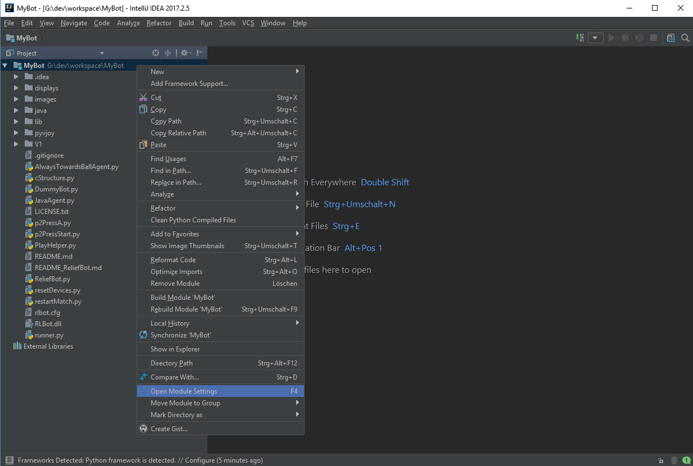
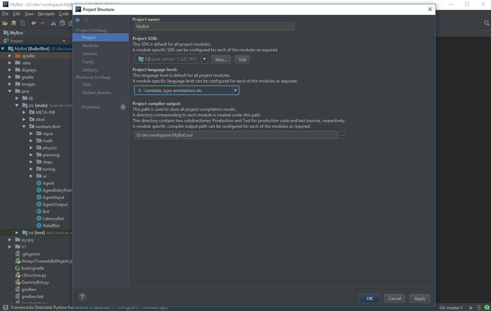
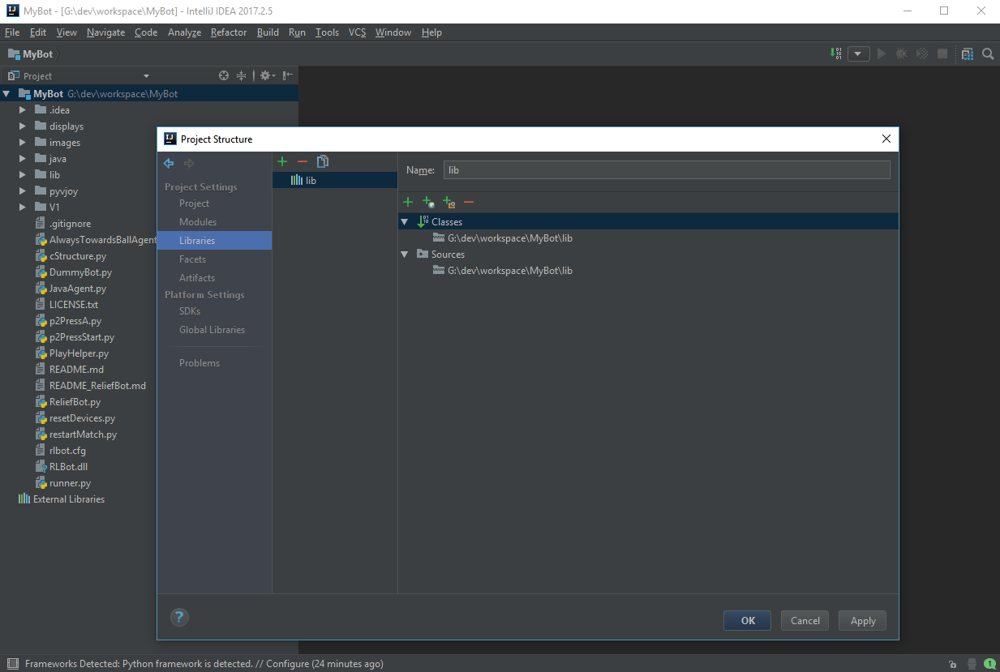
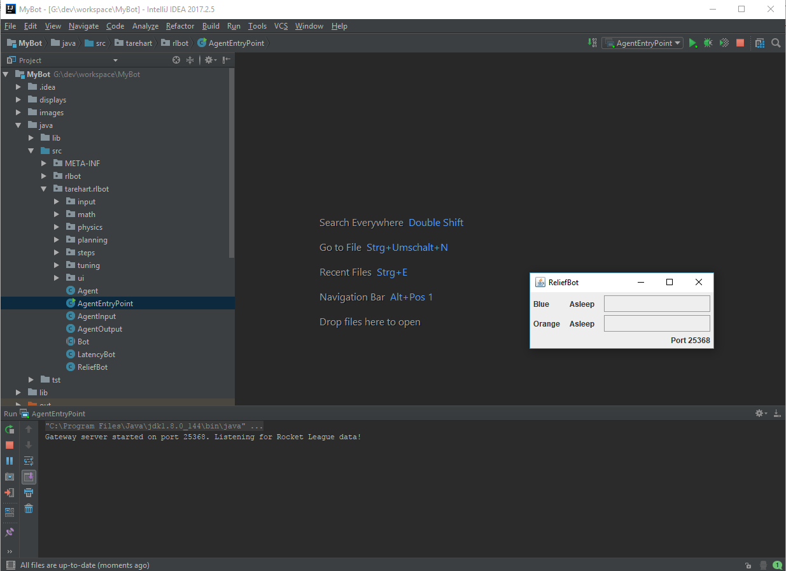

# Requirements
- Basic RLBot Setup    
- tarehart's ReliefBot Source (https://bitbucket.org/tarehart/reliefbot/overview)
- Py4J (pip install py4j)
- Java8
- IntelliJ IDEA (https://www.jetbrains.com/idea/download)

# Step by Step (Requirements)

## Basic RLBot Setup
- Go to (https://github.com/drssoccer55/RLBot/wiki/Setup-Instructions) and complete the setup steps. Make sure everything is working correctly.

## Checking out tarehart's ReliefBot SourceCode

- Head over to (https://bitbucket.org/tarehart/reliefbot/overview) and get the latest version of the Source with a git client of your choice or load the zip-file containing the code.
- Put everything in a folder you wanna work in (e.g. g:/dev/workspace/MyBot/)

## Py4J
- Simple Python Package. Py4J enables Python programs running in a Python interpreter to dynamically access Java objects in a Java Virtual Machine.
- You can install it by opening up a command-line window and calling:
```
pip install py4j
```
- if your command-line is giving you an error that "pip" cannot be found you propably need to google how to install pip first

## Java8
- You need the Java JDK1.8.0_144 to successfully compile the ReliefBot Code.
- Download it at http://www.oracle.com/technetwork/java/javase/downloads/jdk8-downloads-2133151.html  . Choose the correct version for your system.
- Just proceed the installer with standard settings. Remember where the jdk is being installed to, we need that later.
Note: Earlier versions of the JDK have been tested but didn't work. You can try using an older version if you like. 

## IntelliJ IDEA
In order to run the ReliefBot Sourcecode you need IntelliJ IDEA as there are some dependencies related to this IDE. 

Note: Command-Line compiling or using Android Studio won't work without extra work)

- Download the installer from https://www.jetbrains.com/idea/download
- Follow the install instructions. You don't need to select anything special here.
- After the installation is done you can start IntelliJ.
- When you start IntelliJ for the first time on your machine you will be prompted to customize the IDE for your needs.
    - You could press "Skip All and Set Defaults" or do some tweaking. However be sure not to disable plugins that are required. For example the JUnit package in the "Test Tools" category are required by the ReliefBot project.
- You will now see the "Welcome to IntelliJ IDEA" window.

# Setting up the project

- On the IntelliJ Welcome Screen choose "Open"...
- Browse the folder where you checked out the complete ReliefBot repository to. (e.g. g:/dev/workspace/MyBot/)
- Press Ok.
- You should now see a simple Project window with a Folder called "MyBot" on the left. That is the main-module of the project.
- Right click on the "MyBot" folder and select "Open Module Settings"
 
- In the "Project"-Panel we need to select the correct SDK, project language level and output folder.
    - Project SDK: Use the dropdown to select the JDK1.8.0_144 which we installed earlier. If the dropdown is empty Use the "New..." Button, select "JDK" and browse to the installation location of the JDK.
    - Project language level: Select the level "8", anything else will cause errors.
    - Project compiler output: That is the folder where IntelliJ will compile your classes to when running the project.
        - You can just create a new subfolder in the project-directory and call it "out" or "build".
        - Select the path to this folder via the prompt. (e.g. G:\dev\workspace\MyBot\out)
        
        
- Go to the Modules panel and select "Sources".
- You will find the project directory structure there. Select the "java/src" folder and press the "Mark as: 'Sources'" Button.

- Now switch over to the "Libraries" Panel.
- Press the Green "+" Button on top to add a new Library-folder.
- Select "Java".
- Browse to the "lib" folder in the project directory select it and press "Ok". Be sure not to select the "java/lib" folder instead, as it does not contains all needed libraries.
- Confirm the upcoming popup.

- Now Apply the changes we made and go back into the main-project view.
- On the left side open up the "java/src/tarhart/rlbot/" folder.
- RightClick on The "AgentEntryPoint" Class and select "Run AgentEntryPoint.main()"
- If everything is set up correctly you should now see a java-window opened.

- Notice the "AgentEntryPoint" Configuration in the dropdown on the upper right.
- You can select that dropdown and press "Save 'AgentEntryPoint' Configuration". Now you can always start it from there instead of rightclicking the javaclass.
- Your project is now configured correctly and can be used to create awesome bots.

# Running the bots
- Just keep following the steps at (https://github.com/drssoccer55/RLBot/wiki/Setup-Instructions) but make sure run the "runner.py" provided in the ReliefBot repository.
- After starting the runner.py just "Run" the AgentEntryPoint Configuration in IntelliJ.
- The runner.py commandLine should now print "Connection to Java successful!" and your IntelliJ states "Gateway server started on port 'xxx'. Listening for Rocket League data!"

# Troubleshooting
- Compiler can not find the main-class "AgentEntryPoint" when running
    - Check if you have set an output directory in the "Project" panel of the Module or in the Modules/Paths Tab
- NullReferenceException at AgentEntryPoint(line24), StatusSummary
    - This is due to missing dependencies which IntelliJ provides. If you run into this issue you propably dont use IntelliJ.
